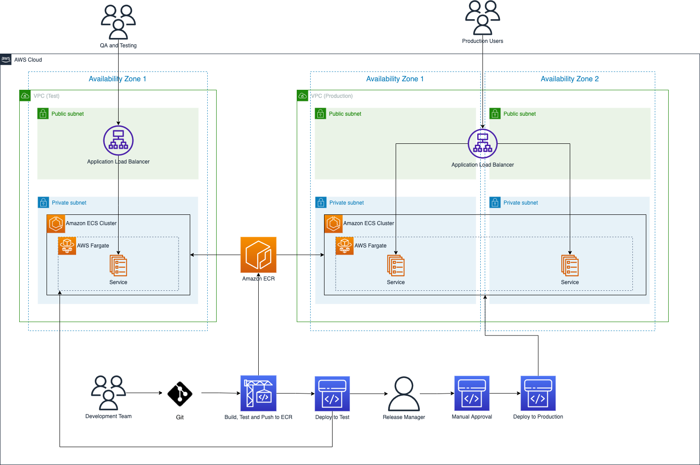
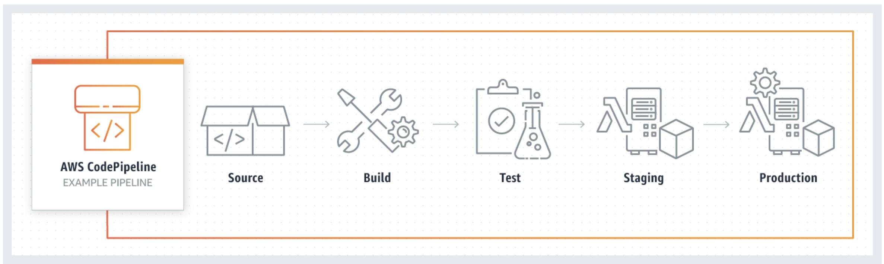
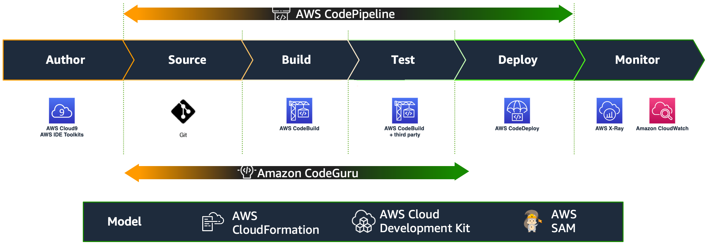

# CI/CD on AWS Workshop

Workshop prático de CI/CD na AWS, cobrindo desde a criação de pipelines automatizados até o deploy de aplicações containerizadas usando as melhores práticas de DevOps.

> Baseado no [CI/CD on AWS Workshop — AWS Workshop Studio](https://catalog.us-east-1.prod.workshops.aws/workshops/40f6bef0-35e1-4aeb-8359-1584d37d916b/en-US)

---

## Sobre o Workshop

Este workshop é voltado para engenheiros de software, engenheiros de plataforma e arquitetos que desejam se familiarizar com as ferramentas de CI/CD da AWS na prática.

**Nível:** 200+ (conhecimento básico em desenvolvimento de aplicações, controle de versão, CI/CD e IaC é recomendado)  
**Duração estimada:** ~3 horas  
**Custo:** Gratuito em eventos AWS. Em conta própria, podem incidir custos — siga a seção de limpeza de recursos ao final.

---

## O que você vai aprender

- Criar aplicações com o **AWS CDK**
- Escrever **Infraestrutura como Código (IaC)**
- Fazer deploy de aplicações CDK na AWS
- Construir pipelines de CI/CD para build, teste e deploy automatizados

---

## Arquitetura alvo



O pipeline conecta os estágios do CodePipeline ao CodeBuild, ECR e ECS Fargate para automatizar o ciclo de entrega completo.

---

## Visão geral do pipeline CI/CD



O pipeline segue os estágios clássicos de CI/CD:

| Estágio | Descrição |
|---|---|
| **Source** | Código submetido ao repositório dispara o pipeline |
| **Build** | Compilação e geração dos artefatos |
| **Test** | Testes automatizados |
| **Staging** | Deploy automático no ambiente de teste |
| **Production** | Aprovação e deploy no ambiente de produção |

---

## Componentes AWS utilizados



| Serviço | Função |
|---|---|
| [AWS CDK](https://aws.amazon.com/cdk/) | Infraestrutura como Código em TypeScript ou Python |
| [AWS CodePipeline](https://aws.amazon.com/codepipeline/) | Orquestração do pipeline de CI/CD |
| [AWS CodeBuild](https://aws.amazon.com/codebuild/) | Build e testes automatizados |
| [AWS CodeDeploy](https://aws.amazon.com/codedeploy/) | Deploy automatizado |
| [AWS CodeCommit](https://docs.aws.amazon.com/codecommit/latest/userguide/welcome.html) | Repositório de código gerenciado |
| [AWS CodeConnections](https://docs.aws.amazon.com/dtconsole/latest/userguide/welcome-connections.html) | Conexões com provedores externos de fonte |
| [Amazon ECR](https://aws.amazon.com/ecr/) | Registry de imagens Docker |
| [Amazon ECS Fargate](https://aws.amazon.com/ecs/) | Execução de containers serverless |
| [Docker](https://aws.amazon.com/docker/) | Containerização da aplicação |

---

## Estrutura do projeto

```
cicd-workshop/
├── assets/             # Imagens e diagramas do workshop
├── hello-app/          # Aplicação de exemplo (React + Vite + TypeScript)
│   ├── src/
│   ├── Dockerfile
│   └── package.json
└── workshop.md         # Descrição completa do workshop
```

### hello-app

Aplicação web de exemplo containerizada, construída com:

- **React 19** + **TypeScript**
- **Vite** como bundler
- **Docker** para containerização
- **oxlint** para linting

---

## Regiões suportadas

Este workshop utiliza AWS CodeBuild com Lambda compute, disponível nas seguintes regiões:

- us-east-1 (N. Virginia)
- us-east-2 (Ohio)
- us-west-2 (Oregon)
- ap-south-1 (Mumbai)
- ap-southeast-1 (Singapura)
- ap-southeast-2 (Sydney)
- ap-northeast-1 (Tóquio)
- eu-central-1 (Frankfurt)
- eu-west-1 (Irlanda)
- sa-east-1 (São Paulo)

---

## Práticas abordadas

- Desenvolvimento de aplicações web com **Docker containers**
- Controle de versão com serviços de source control na AWS
- **Integração Contínua** para build e testes automatizados
- **Deploy Contínuo** para o ambiente de teste
- **Entrega Contínua** com aprovação para produção
- **Infraestrutura como Código** para definir toda a stack em código

---

## Limpeza de recursos

Ao finalizar o workshop, remova os recursos criados para evitar cobranças desnecessárias na sua conta AWS. Siga as instruções na seção **Clean Up Resources** do workshop original.
